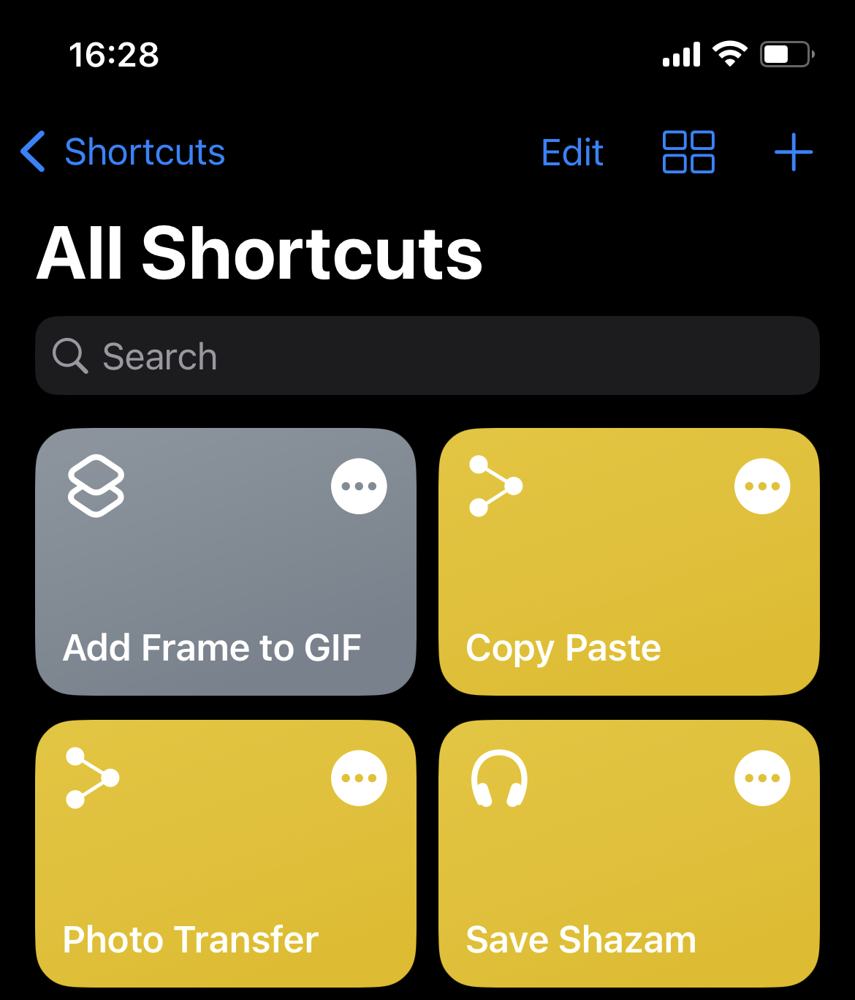
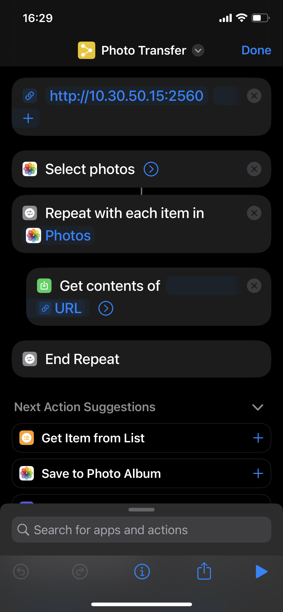

# iphone-shortcuts-media-transfer
Transfer your photo, video or any media to PC wirelessly via IPhone's Shortcuts application with Http Post request.

## How To Make It Work
Your IPhone and the PC you want to transfer, both must be in the same network.
First you need to compile the "ShortcutsListener" C# .net project and run the application (server).
(Compiled version exists in ShortcutsListener/ShortcutsListener/bin/Release folder)
In order to transfer media from your IPhone you need to create a shortcut from IPhone's Shortcuts application by tabbing + sign.

  

then actions are seen below needs to be added.

- Add the "URL" action and set the IP address of your computer and the port to URL action (default port is 2560).
If your pc has a IPAdress of 192.168.1.10 then the "URL" action should be http://192.168.1.10:2560 the number after the semicolon is the port number.
- Add the "Select photos" action this action opens the photo app of your phone and lets you select desired photos or videos when you run the completed shortcut.
- Since "Select photos" returns "Photos" variable that is contains more than one media we need to iterate each of them by adding "Repeat with Each" action.
- Inside the "Repeat with Each" action "Get contents of" action needs to be added. This is the action actually does the job.

  

"Get contents of" action is the action that makes the HTTP request.
Configure the contents of the "Get contents of" action like below.
- Set the HTTP request method as POST.
- "filename" header must be added to the HTTP request and "Repeated Item" needs to be pointed in order to get filename.
- You need to set the URL of the "Get contents of" action to the url you added previously.

  

Now you can start the server and then run the shortcut.
All selected photos and videos will be transfered to PC.
You may need to download required codecs to your computer to view your files.

You can do other shortcuts that can send other file types from IPhone's "Files" application. Its up to your imagination. 
